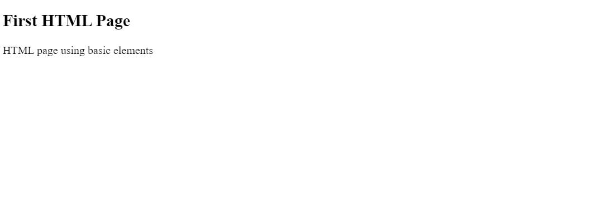

# HTML page using basic tags or elements

```html
<!DOCTYPE html>
<html lang="en">
  <head>
    <meta charset="UTF-8" />
    <meta name="viewport" content="width=device-width, initial-scale=1.0" />
    <title>First HTML Page</title>
    
  </head>

  <body>
       
    <h2>First HTML Page</h2>
    <p>HTML page using basic elements</p>
    
    <!-- This is for JavaScript -->
    <script src="C:/Users/lenovo/Documents/GitHub/learn-html-css-javascript/learnhtml/js/main.js"> </script>
    
  </body>
</html>
```


