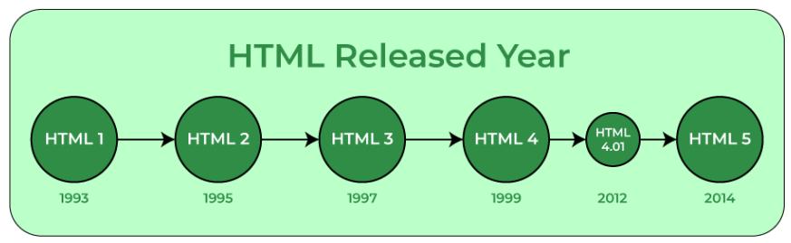

# HTML Introduction
HTML is the standard markup language for creating Web pages.

## What Is HTML?
* HTML stands for Hyper Text Markup Language
* HTML is the standard markup language for creating Web pages
*  It was introduced by Tim Berners-Lee in 1991 at CERN as a simple markup language. Since then, it has evolved through versions from HTML 2.0 to HTML5 (the latest 2024 version).
* HTML describes the structure of a Web page
* HTML consists of a series of elements
* HTML elements tell the browser how to display the content

##  Features of HTML
* It is easy to learn and easy to use.
* It is platform-independent.
* Images, videos, and audio can be added to a web page.


## HTML Structure

```HTML
<!DOCTYPE html>
<html>
<head>
<title>Page Title</title>
</head>
<body>

<h1>My First Heading</h1>
<p>My first paragraph.</p>

</body>
</html>
```

### Explination of abve HTML structure
```HTML
* The <!DOCTYPE html> declaration defines that this document is an HTML5 document
* The <html> element is the root element of an HTML page
* The <head> element contains meta information about the HTML page
* The <title> element specifies a title for the HTML page (which is shown in the browser's title bar or in the page's tab)
* The <body> element defines the document's body, and is a container for all the visible contents, such as headings, paragraphs, images, hyperlinks, tables, lists, etc.
* The <h1> element defines a large heading
* The <p> element defines a paragraph
```
## What is an HTML Element?
An HTML element is defined by a start tag, some content, and an end tag:
<tagname> Content goes here... </tagname>
The HTML element is everything from the start tag to the end tag:
 ```HTML
<h1>My First Heading</h1>
<p>My first paragraph.</p>
```
## Web Browsers

Web browsers show the results of an HTML code. It reads HTML files and determines how to show content with the help of HTML tags.
Any web browser (Google, Safari, Mozilla Firefox, etc) can be used to open a . HTML file and view the results.

## Advantages of HTML
* HTML is used to build websites.
* It is supported by all browsers.
* It can be integrated with other languages like CSS, JavaScript, etc.

## HTML History



## What is an HTML editor?
* An HTML editor is a tool/software that can create, edit, and manage HTML code. They provide various features to simplify the process of writing HTML code.
* One can write HTML code in any text editor and save the file with an extension “.html” or “.htm” to see the working of that file.